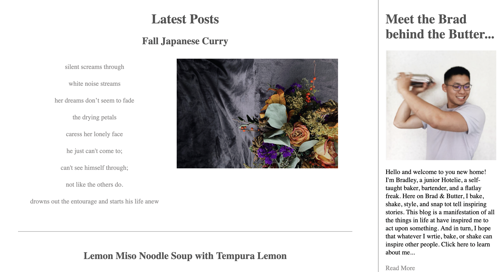

# Food Blogger Website

## Website Screenshots

## Table of Contents

1. Description
2. Features
3. Technologies Used
4. Installation
6. License

Description:
Welcome to the Food Blogger Website! This website showcases the culinary adventures, personal stories, and delicious recipes of our favorite food blogger. Whether you're a seasoned chef or just starting in the kitchen, there's something for everyone to enjoy.

## Features

Personal Stories: Get to know the food blogger and the inspiration behind their culinary journey through engaging personal stories.
Tantalizing Recipes: Explore a wide array of mouthwatering recipes, complete with detailed instructions and ingredient lists.
Responsive Design: The website is fully responsive, ensuring an optimal viewing experience on various devices, including desktops, tablets, and mobile phones.
Interactive Interface: Enjoy a user-friendly interface with smooth navigation and interactive elements.
Search Functionality: Easily find specific recipes or stories using the built-in search feature.

## Technologies Used

1. HTML
2. CSS
3. JavaScript
4. Jquery

## Installation

To run the Food Blogger Website locally, follow these steps:

Clone the repository
Navigate to the project directory: cd Brad-Butter
Open the index.html file in your preferred web browser.
Usage

Upon opening the website, you will be greeted with the homepage featuring a selection of the latest recipes and stories.
Explore the different sections, such as "Recipes" and "Personal Stories," using the navigation menu.
Click on a recipe or story to view its full details.
To search for specific content, use the search bar located at the top of the page.
Enjoy reading the food blogger's experiences and trying out their delicious recipes!
Contributing

## License

The Food Blogger Website is open-source and available under the MIT License.
